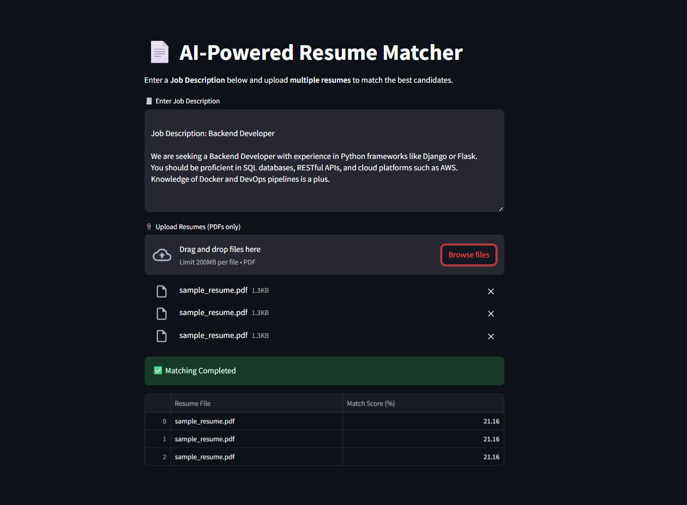

# 🤖 AI-Powered Resume Scanner

Effortlessly match candidate resumes with job descriptions using AI.  
This project enables HR teams and recruiters to **automatically score and rank resumes** based on their relevance to a job description — saving hours of manual screening time.

---

## 🚀 Key Features

- 🧠 **AI-Powered Matching:** Uses TF-IDF + Cosine Similarity to evaluate how well a resume matches the job description.
- 📂 **Multiple Resume Uploads:** Upload bulk resumes at once and get a ranked list instantly.
- ✍️ **Manual JD Input:** No need to upload a file — just paste the job description directly into the app.
- 📊 **Match Scores Displayed:** See resume match percentages to prioritize the most relevant candidates.
- ⚡ **Simple Interface:** Clean Streamlit app that works in any browser — no coding required to use.

---

## 💼 Why This Matters for Recruiters

Recruiters spend hours skimming through resumes to find suitable candidates.

✅ With this tool:
- You **paste the job description**
- **Upload a bunch of resumes**
- Get a **ranked list with match scores**, within seconds!

It helps you:
- Eliminate unqualified applicants early
- Focus interview time on high-potential candidates
- Improve recruitment efficiency

---

## 🖥️ How It Works

1. Enter the job description in the text box
2. Upload multiple resumes in PDF format
3. The AI model:
   - Extracts and preprocesses text
   - Converts resume and JD into vectors
   - Calculates cosine similarity
4. Displays a sorted table with match scores

---

## 📸 Preview

 <!-- Replace with actual screenshot -->

---

## 🔧 Tech Stack

- Python 🐍
- Streamlit 🌐 (Web Interface)
- Scikit-learn (TF-IDF + Cosine Similarity)
- PyPDF2 (PDF Parsing)
- NLTK (Text Cleaning)

---

## 📁 Folder Structure

resume-scanner/
├── app.py # Streamlit frontend
├── resumes/ # Folder for uploaded resumes
├── src/ # Core logic
│ ├── matcher.py # Matching logic using TF-IDF + Cosine Similarity
│ ├── resume_parser.py # Extract text from PDFs
│ └── text_cleaner.py # Text preprocessing
├── job_descriptions/ # (Optional) Sample JDs
├── resume_matcher_demo.ipynb # Jupyter Notebook version
└── README.md # Project overview and instructions

---